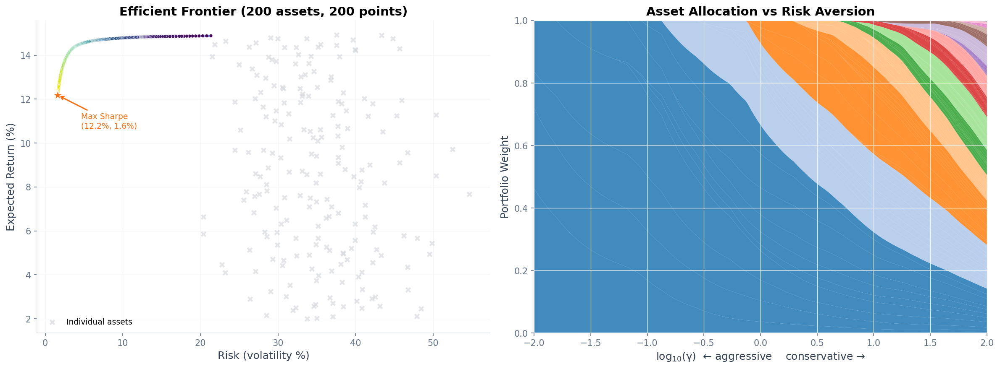
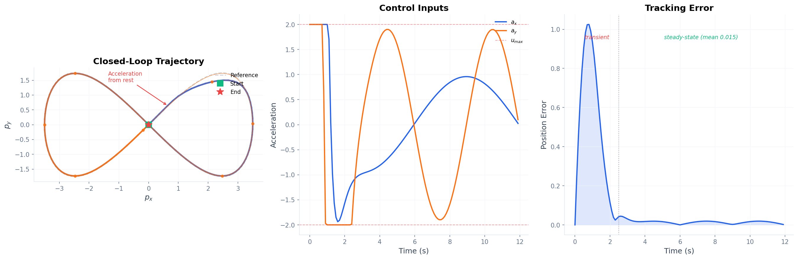
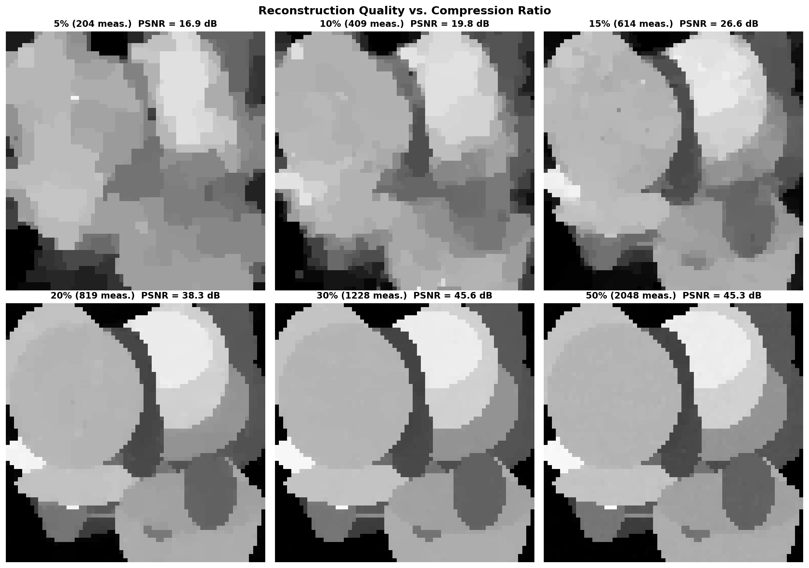
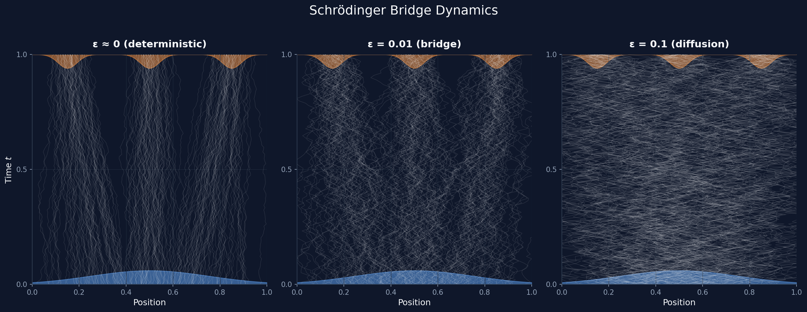
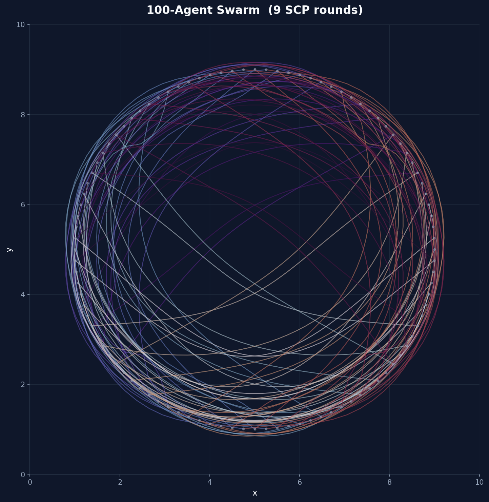
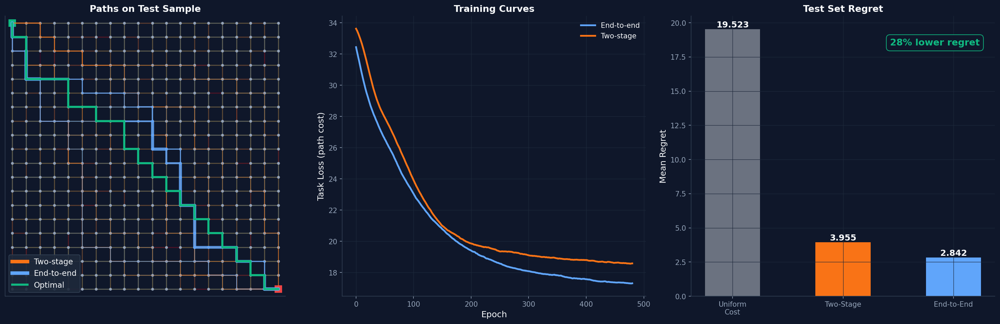
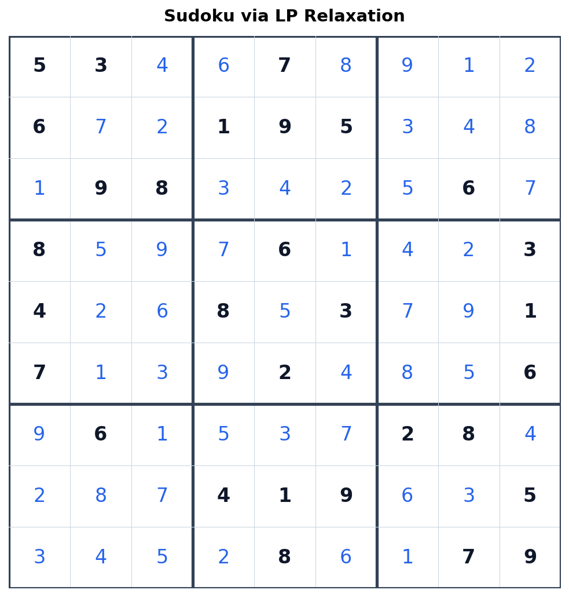
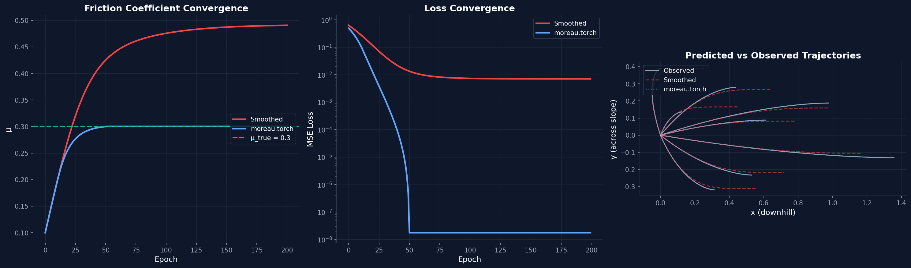
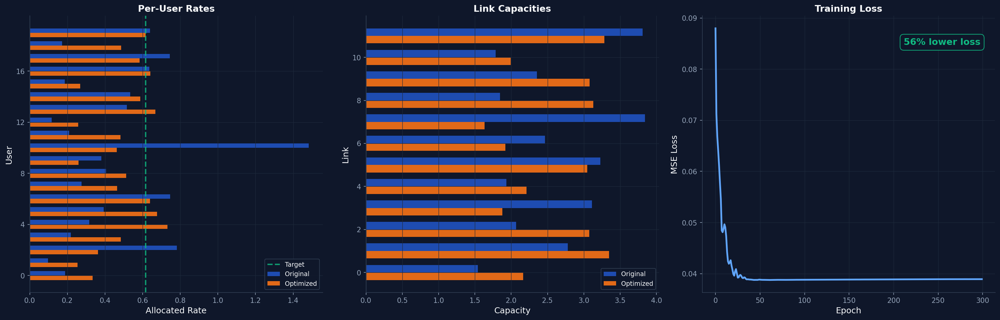
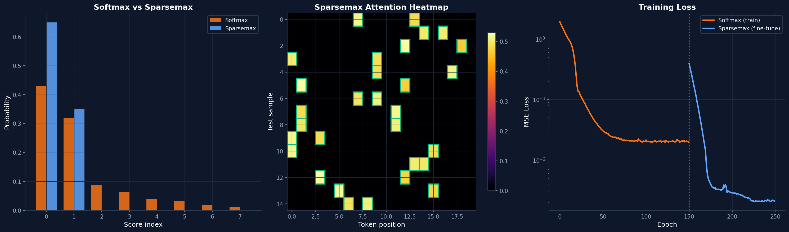

# Moreau Examples

**GPU-accelerated differentiable convex optimization** — a visual gallery of notebooks showcasing [Moreau](https://moreau.so).

## Quick Start

```bash
git clone https://github.com/moreau-opt/moreau-examples.git
cd moreau-examples
pip install jupyter numpy scipy matplotlib seaborn torch cvxpy cvxpylayers Pillow
jupyter notebook notebooks/
```

> **Moreau install**: Follow the [install instructions](https://moreau.so/install) to set up Moreau for your platform before running the notebooks.

## Gallery

| | Notebook | Description | Features |
|---|---|---|---|
|  | [Portfolio Optimization](notebooks/portfolio_optimization.ipynb) | Markowitz mean-variance optimization: CVXPY, `moreau.Solver`, batched frontier via `CompiledSolver`, differentiable Jacobians via `moreau.torch`, warm-started rolling rebalancing. | `CompiledSolver` `moreau.torch` `batched` `differentiable` `warm-start` `GPU` |
|  | [MPC Trajectory Control](notebooks/mpc_trajectory.ipynb) | Model Predictive Control for a 2D vehicle. Closed-loop simulation with warm starting, animated GIF, 16 initial states solved in parallel. | `CompiledSolver` `batched` `warm-start` `animation` |
|  | [Compressed Sensing](notebooks/compressed_sensing.ipynb) | 1D sparse recovery, 2D image reconstruction via TV minimization, and learning the measurement matrix by differentiating through the reconstruction solver. | `CVXPY` `cvxpylayers` `differentiable` `LP` |
|  | [Schrödinger Bridges](notebooks/optimal_transport.ipynb) | Entropy-regularized optimal transport as a Schrödinger bridge. Batched sweep of 64 mass-conservation penalties via cvxpylayers. | `cvxpylayers` `batched` `exp-cones` `animation` |
|  | [Swarm Motion Planning](notebooks/swarm_planning.ipynb) | 100 agents swap positions on a circle without collisions. SCP with batched GPU solves — each round is one `CompiledSolver` call. | `CompiledSolver` `batched` `GPU` `QP` `SCP` |
|  | [Predict, then Optimize](notebooks/predict_then_optimize.ipynb) | Shortest path routing on a 20×20 grid with learned edge costs. End-to-end training through a differentiable LP layer achieves lower regret than two-stage. | `cvxpylayers` `batched` `differentiable` `GPU` `PyTorch` `animation` |
|  | [Sudoku](notebooks/sudoku.ipynb) | Sudoku via LP relaxation — 729 variables, exact integer solution from convex relaxation. 256 puzzles solved simultaneously. | `CompiledSolver` `batched` `LP` `GPU` |
|  | [Differentiable Contact](notebooks/contact_friction.ipynb) | Learn friction from observed motion: Coulomb friction cones (SOC3), chain of differentiable contact solves. Shows why smoothed contact (MuJoCo-style) fails where `moreau.torch` succeeds. | `moreau.torch` `differentiable` `SOC` |
|  | [Fair Bandwidth Allocation](notebooks/bandwidth_allocation.ipynb) | Alpha-fairness via power cones: sweep the fairness-throughput tradeoff, then learn optimal link capacities by differentiating through the fair allocation solver. | `cvxpylayers` `differentiable` `GPU` `power-cones` `animation` |
|  | [Sparsemax Attention](notebooks/sparsemax_attention.ipynb) | Sparse attention via simplex projection QP. Train softmax, swap to sparsemax for exact-zero attention weights, fine-tune end-to-end through `cvxpylayers`. | `CVXPY` `cvxpylayers` `differentiable` `PyTorch` |

## Feature Matrix

| Notebook | Interface | Batched | Differentiable | Warm Start | GPU | Cones |
|---|---|:---:|:---:|:---:|:---:|---|
| Portfolio | `CompiledSolver` `moreau.torch` | :white_check_mark: | :white_check_mark: | :white_check_mark: | :white_check_mark: | zero, nonneg |
| MPC | `CompiledSolver` | :white_check_mark: | | :white_check_mark: | :white_check_mark: | zero, nonneg |
| Compressed Sensing | `CVXPY` `cvxpylayers` | | :white_check_mark: | | | zero, nonneg |
| Schrödinger Bridges | `cvxpylayers` | :white_check_mark: | :white_check_mark: | | | zero, nonneg, exp |
| Swarm Planning | `CompiledSolver` | :white_check_mark: | | | :white_check_mark: | zero, nonneg |
| Predict, then Optimize | `cvxpylayers` | :white_check_mark: | :white_check_mark: | | :white_check_mark: | zero, nonneg |
| Sudoku | `CompiledSolver` | :white_check_mark: | | | :white_check_mark: | zero, nonneg |
| Contact Friction | `moreau.torch` | | :white_check_mark: | | | SOC |
| Bandwidth Allocation | `cvxpylayers` | | :white_check_mark: | | :white_check_mark: | zero, nonneg, power |
| Sparsemax Attention | `CVXPY` `cvxpylayers` | | :white_check_mark: | | | zero, nonneg |

## Project Structure

```
moreau-examples/
├── README.md
├── pyproject.toml
├── assets/                    # Pre-rendered thumbnails and GIFs
├── utils/
│   ├── style.py               # Shared color palette + matplotlib theme
│   ├── animation.py           # GIF/animation helpers
│   └── sparse.py              # CSR matrix construction helpers
├── notebooks/
│   ├── portfolio_optimization.ipynb
│   ├── mpc_trajectory.ipynb
│   ├── compressed_sensing.ipynb
│   ├── optimal_transport.ipynb
│   ├── swarm_planning.ipynb
│   ├── predict_then_optimize.ipynb
│   ├── sudoku.ipynb
│   ├── contact_friction.ipynb
│   ├── bandwidth_allocation.ipynb
│   └── sparsemax_attention.ipynb
└── scripts/
    └── render_notebooks.py    # Execute all notebooks + extract thumbnails
```

## Requirements

- Python 3.12+
- [Moreau](https://moreau.so/install)
- NumPy, SciPy, Matplotlib, Seaborn, PyTorch, CVXPY, cvxpylayers, Pillow

All notebooks use `float64` precision and include committed outputs — you can browse the results on GitHub without running anything.

## Links

- [Moreau Documentation](https://docs.moreau.so)
- [Moreau API Reference](https://docs.moreau.so/api/core)

## License

Apache 2.0
